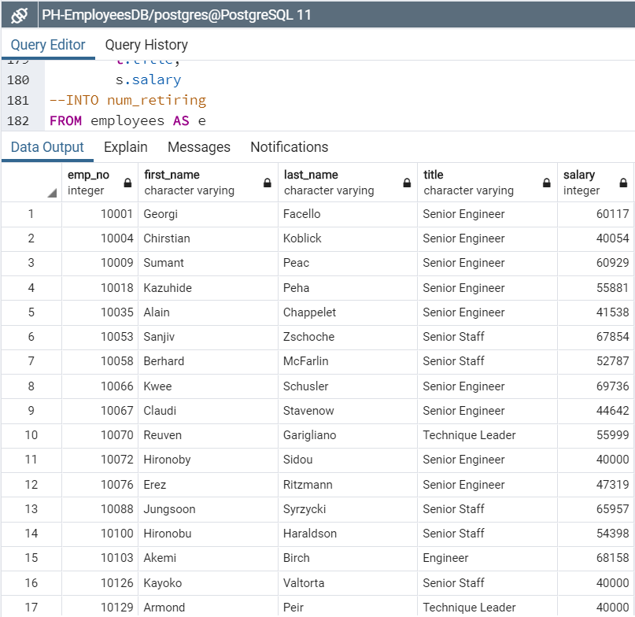

# Pewlett-Hackard-Analysis

Building upon Bobby’s work in identifying the potential retirement pool, an entity-relationship diagram (ERD) was prepared.   It lays out the CSV files and relationships between the fields in the various tables, needed to perform the queries that are the foundation of this analysis.  The ERD, produced in QuickDBD, can be found below.  The sql file with the schema to this can be found in the main folder of the Pewlett-Hackard-Analysis repository.

The first query requested was developed to detail those employees born between January 1, 1952 and December 31, 1955, and hired in the 4 years 1985-1988.  A list of 33,118 employees (featuring their employee #, first and last names, titles, and salaries) was compiled and deposited into a CSV file (num_retiring.csv), including the employee number, first and last name, title, and salary.  Here’s what the code and the output looked like in pgAdmin.

If those in the pool making $80,000/year or more took early retirement, only 12,212 of the 33,118 eligible employees (36.9%) would be involved, yet their combined salaries of $839,377,155 represent 47.9% of the overall pool’s payroll.  If those 12,212 positions were replaced with entry level new hires making an average of $35,000/year, the price-tag would be $427,420,000, considerably less than those they'd be replacing.

A second query was requested to list a count of employee titles in descending order by date.  I have extracted the year from the date that each identified employee began his or her most recent position with company.  A piece of information that was missing from the request was the sum of salaries for each count.  This figure was also obtained by using the “EXTRACT” function, as shown in the code for the query.  Below that image is a sample of the output from the pgAdmin query.  Results of the query may be found in the retire_by_from_yr.csv file.

Another scenario for the retirement pool can be evaluated from this query.  People who have been in their positions for a very long time, may be getting stale in their roles, becoming less productive, and be more willing to accept a retirement package.  To come up with a comparable number of retirees to that proposed form query 1, offering retirement to employees starting their positions in 1985 through 1987, 14,070 would be affected with combined annual salaries of $747,202,266.  These figures represent 42.5% and 42.6% of the overall retirement pool’s # of positions and overall payroll.

This seems like better option and can be expanded to include more years.  If retirement is offered to all of those candidates who began their most recent position between 1985 and 1994, 26,609 positions would be affected with a total payroll of $1,409,779,836.  Average salary for those employees is $52,981.  If all of those positions are replaced with new hires averaging a salary of $35,000, then the company will enjoy an annual savings of $478,464,836.

There are 1,549 employees born in 1965, the birth year identified as the potential mentors for those replacing the people who will be retiring.  While the query requested identifies those of an appropriate ago to be mentors, this should not be the sole criteria for mentorship.  Longevity and experience with the company is also important, so I have added an extra column, that being the hire year, extracted from the hire date.  I propose that only those hired before 1995 be considered.  This reduces the mentor group from 1,549 to 1,358.  Here is the code and sample output from this third query.

In conclusion, the retirement package should be offered to those 1952-1955 birthdate/1985-1988 hire date employees commencing their current positions prior to January 1, 1995.  This is 26,609 positions with a payroll of $1.41 billion.  By replacing those people with new hires estimated to make an average of $35,000/year, the company will save over $478 million annually.  A small portion of that savings can be used for compensating those 1,358 employees born in 1965 (and hired by the company prior to 1995) to act as mentors.  If these people are offered a bonus of $10,000/year for acting as a mentor, the cost to the company is only $13,580,000 or 2.8% of the savings created by the retirement program.  Your instructions asked for recommendations for further analysis...further analysis which has already been done and incorporated into this report.

(SQL code for the requested queries can be found in the queries folder in the repository, as can the code for the ERD).
